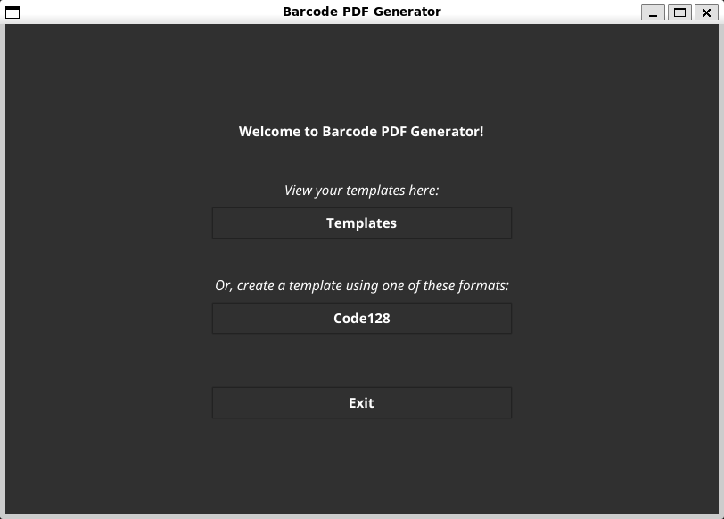
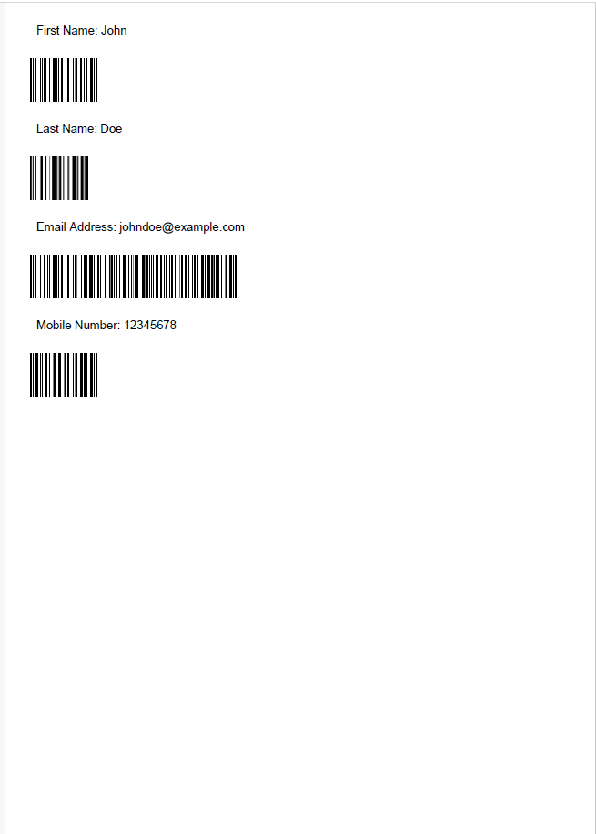

# Barcode PDF Generator
Generate a PDF with custom barcodes from user inputs via a GUI.

## Pre-requisites
Runs on linux/amd64.\
Make sure you have at least Go v1.22.3 installed.

## Installation

Clone the repo:

```bash
git clone https://github.com/AhGr3y/barcode-label-pdf.git
```

## Usage (Linux)

Just run the following command to open the GUI:

```bash
go run .
```

## Usage (Windows)

1. Generate the executable `.exe`.
    - This will generate a `.zip` file which contains the `.exe` file in the `./fyne-cross/dist/` directory.
    - You can use any name other than 'com.example.barcode-pdf.generator' as long as it's a unique name throughout your system.
```bash
fyne-cross windows -app-id com.example.barcode-pdf-generator
```
2. Create a folder anywhere in your Windows system, then copy the `/output` and `/templates` directory into the folder.
    - The application needs the files inside these directories to run.
3. Run the application!

## Examples

Homepage:



Output:


